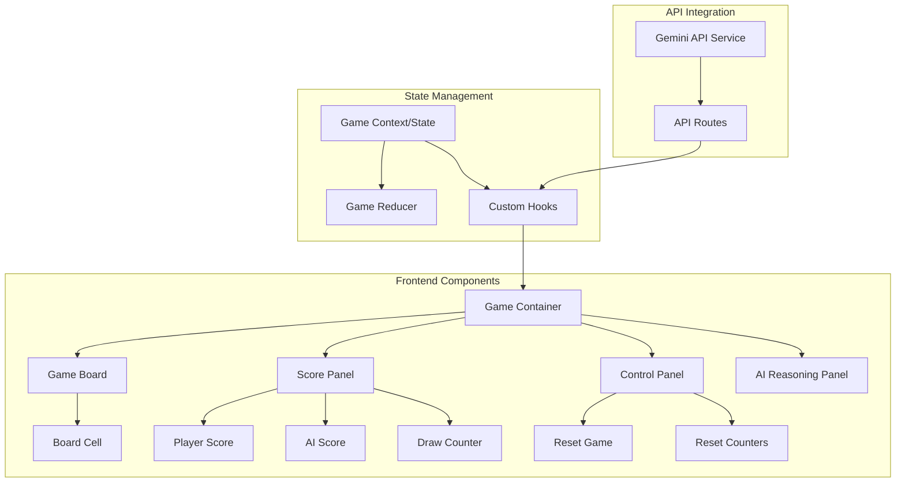

# Tic-Tac-Toe with Gemini AI - Development Plan

## Project Overview

We'll build a modern tic-tac-toe game with the following features:

- Next.js 15 with TypeScript, App Router, and src directory structure
- Turbopack for development
- Google Gemini 2.0 Flash model as an unbeatable AI opponent
- Dark theme with modern UI, animations, and custom X/O icons
- Mobile-responsive design
- Win/draw counters for both players
- AI reasoning display window
- Reset game and counters functionality
- Functional programming patterns

## Architecture Diagram



## Development Phases

### Phase 1: Project Setup and Environment Configuration

- Initialize Next.js 15 project with TypeScript, App Router, and src directory
- Configure Turbopack
- Set up environment variables for Gemini API
- Install and configure shadcn/ui components
- Configure dark theme and responsive base styles

### Phase 2: Game Core Logic and State Management

- Create game state using functional React patterns
- Implement game board logic and win detection
- Develop turn management system
- Build score tracking functionality

### Phase 3: UI Components Development

- Create responsive game board with modern styling
- Build score display components
- Design custom X and O icons with animations
- Implement game control buttons
- Develop AI reasoning display panel

### Phase 4: Google Gemini API Integration

- Set up API service for Gemini integration
- Create API route for secure communication
- Implement AI move calculation logic
- Extract and display AI reasoning

### Phase 5: Styling and UI Enhancements

- Apply dark theme with modern color scheme
- Add animations and transitions
- Implement responsive design for mobile
- Optimize UI for different screen sizes

### Phase 6: Testing and Optimization

- Verify game logic works correctly
- Test API integration
- Optimize performance
- Ensure mobile responsiveness

### Phase 7: Final Polish and Deployment

- Add final styling refinements
- Ensure clean code and documentation
- Prepare for deployment

## Technical Implementation Details

### Phase 1: Project Setup and Environment Configuration

#### 1.1 Initialize Next.js Project

```bash
npx create-next-app@latest . --typescript --eslint --app --src-dir --use-npm
```

#### 1.2 Configure Environment Variables

Create `.env.local`:

```
GEMINI_API_KEY=your_api_key_here
```

#### 1.3 Install shadcn/ui

Follow the latest approach for Next.js 15:

```bash
npx shadcn-ui@latest init
```

Configure for dark theme in `globals.css`.

### Phase 2: Game Core Logic and State Management

#### 2.1 Game State

```typescript
// Types
type Player = 'X' | 'O' | null
type Board = Player[]
type GameState = {
  board: Board
  currentPlayer: 'X' | 'O'
  winner: Player
  isDraw: boolean
  scores: {
    X: number // Human
    O: number // AI
    draw: number
  }
  aiReasoning: string
  isAiThinking: boolean
}

// Actions
type GameAction =
  | { type: 'MAKE_MOVE'; index: number }
  | { type: 'SET_AI_MOVE'; index: number; reasoning: string }
  | { type: 'RESET_GAME' }
  | { type: 'RESET_SCORES' }

// Reducer (Functional approach)
const gameReducer = (state: GameState, action: GameAction): GameState => {
  switch (
    action.type
    // Implementation of each action
  ) {
  }
}
```

#### 2.2 Game Logic Functions

```typescript
// Win detection (pure function)
const checkWinner = (board: Board): Player => {
  // Check win patterns and return winner or null
}

// Draw detection (pure function)
const checkDraw = (board: Board): boolean => {
  return board.every((cell) => cell !== null)
}
```

### Phase 3: UI Components Development

#### 3.1 Game Board Component

```tsx
const GameBoard: React.FC = () => {
  const { state, dispatch } = useGameContext()

  const handleCellClick = (index: number) => {
    if (
      !state.board[index] &&
      !state.winner &&
      !state.isDraw &&
      state.currentPlayer === 'X'
    ) {
      dispatch({ type: 'MAKE_MOVE', index })
    }
  }

  return (
    <div className="grid grid-cols-3 gap-2">
      {state.board.map((cell, index) => (
        <BoardCell
          key={index}
          value={cell}
          onClick={() => handleCellClick(index)}
        />
      ))}
    </div>
  )
}
```

#### 3.2 Score Panel

```tsx
const ScorePanel: React.FC = () => {
  const { state } = useGameContext()

  return (
    <div className="flex justify-between">
      <ScoreCard title="You (X)" score={state.scores.X} />
      <ScoreCard title="Draws" score={state.scores.draw} />
      <ScoreCard title="AI (O)" score={state.scores.O} />
    </div>
  )
}
```

### Phase 4: Google Gemini API Integration

#### 4.1 API Route for Gemini

```typescript
// app/api/gemini/route.ts
import { GoogleGenerativeAI } from '@google/generative-ai'

export async function POST(request: Request) {
  const { board } = await request.json()

  const genAI = new GoogleGenerativeAI(process.env.GEMINI_API_KEY!)
  const model = genAI.getGenerativeModel({ model: 'gemini-2.0-flash' })

  const formattedBoard = formatBoard(board)

  const prompt = `
    I'm playing tic-tac-toe as 'O' against a human who is 'X'. 
    Current board state:
    ${formattedBoard}
    
    As an unbeatable tic-tac-toe AI:
    1. What is the optimal move (as an index 0-8)?
    2. Explain your strategic reasoning in detail.
    
    Return JSON:
    {
      "move": index,
      "reasoning": "your explanation"
    }
  `

  try {
    const result = await model.generateContent(prompt)
    const textResponse = result.response.text()
    const moveData = extractJson(textResponse)

    return Response.json(moveData)
  } catch (error) {
    // Error handling
    return Response.json({ error: 'Failed to get AI move' }, { status: 500 })
  }
}
```

#### 4.2 AI Service

```typescript
// AI move calculation
export const getAIMove = async (
  board: Board
): Promise<{ move: number; reasoning: string }> => {
  try {
    const response = await fetch('/api/gemini', {
      method: 'POST',
      headers: { 'Content-Type': 'application/json' },
      body: JSON.stringify({ board }),
    })

    if (!response.ok) throw new Error('API request failed')
    return await response.json()
  } catch (error) {
    console.error('Error getting AI move:', error)
    // Fallback strategy
    return getFallbackMove(board)
  }
}
```

### Phase 5: Styling and UI Enhancements

#### 5.1 Custom Board Cell with Animation

```tsx
const BoardCell: React.FC<{ value: Player; onClick: () => void }> = ({
  value,
  onClick,
}) => {
  return (
    <button
      onClick={onClick}
      className={cn(
        'aspect-square bg-slate-800 rounded-lg flex items-center justify-center text-4xl transition-all',
        'hover:bg-slate-700 focus:ring-2 focus:ring-slate-400',
        'animate-in fade-in-50 duration-300',
        { 'pointer-events-none': value !== null }
      )}
    >
      {value === 'X' && (
        <XIcon className="text-emerald-400 w-12 h-12 animate-in zoom-in-50 duration-200" />
      )}
      {value === 'O' && (
        <OIcon className="text-violet-400 w-12 h-12 animate-in zoom-in-50 duration-200" />
      )}
    </button>
  )
}
```

#### 5.2 Responsive Layout

```tsx
<div className="container mx-auto px-4 py-8 max-w-md">
  <div className="grid grid-cols-1 md:grid-cols-2 gap-6">
    <div className="space-y-6">
      <h1 className="text-3xl font-bold text-center">Tic-Tac-Toe vs Gemini</h1>
      <ScorePanel />
      <GameBoard />
      <GameControls />
    </div>
    <div className="hidden md:block">
      <AIReasoningPanel />
    </div>
    <div className="block md:hidden mt-6">
      <AIReasoningPanel />
    </div>
  </div>
</div>
```

## Project File Structure

```
/src
  /app
    /api
      /gemini
        route.ts
    layout.tsx
    page.tsx
    globals.css
  /components
    /ui              # shadcn components
    /game
      board.tsx
      board-cell.tsx
      score-panel.tsx
      ai-reasoning-panel.tsx
      game-controls.tsx
    layout.tsx
  /lib
    /utils           # utility functions
    /hooks
      use-game.ts
    /types           # TypeScript types
    /context
      game-context.tsx
    /services
      gemini-service.ts
  /styles            # additional styles
.env.local          # API key
```

## Implementation Timeline

1. **Week 1:** Phases 1-2 (Setup and Core Game Logic)
2. **Week 2:** Phases 3-4 (UI Components and API Integration)
3. **Week 3:** Phases 5-7 (UI Enhancement, Testing, and Polish)

## Key Technical Considerations

1. **Functional Programming Approach**

   - Use pure functions for game logic
   - Implement immutable state updates
   - Use composition over inheritance

2. **API Security**

   - Keep Gemini API key secure in server-side routes
   - Implement error handling and fallbacks

3. **Responsive Design**

   - Design for mobile-first
   - Optimize layout for different screen sizes

4. **Performance**
   - Optimize component rendering
   - Minimize API calls
